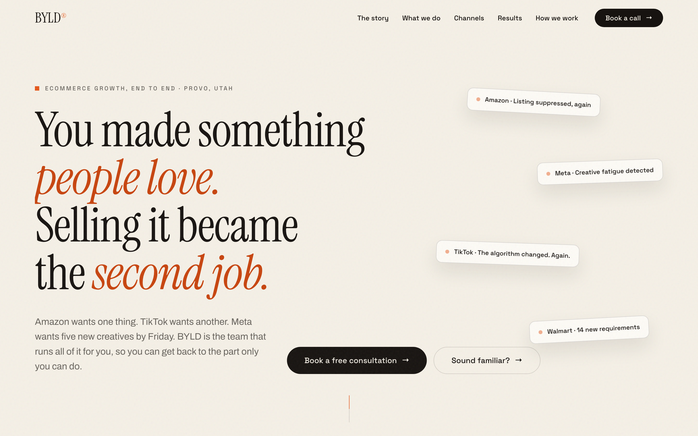
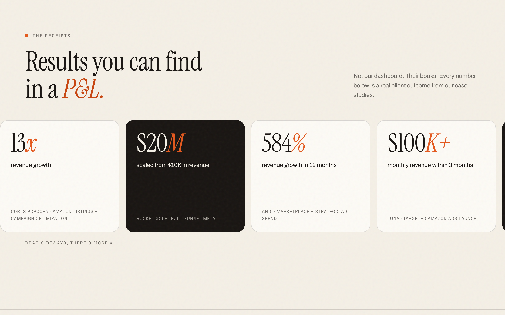
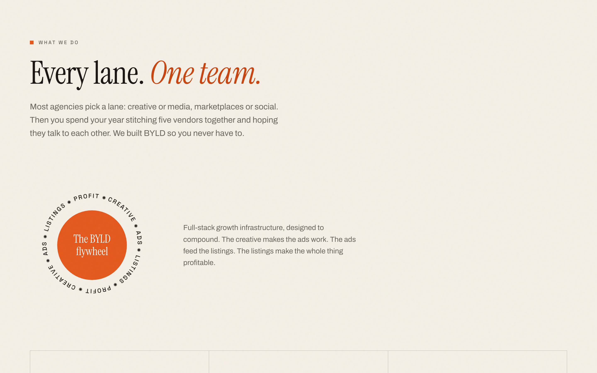
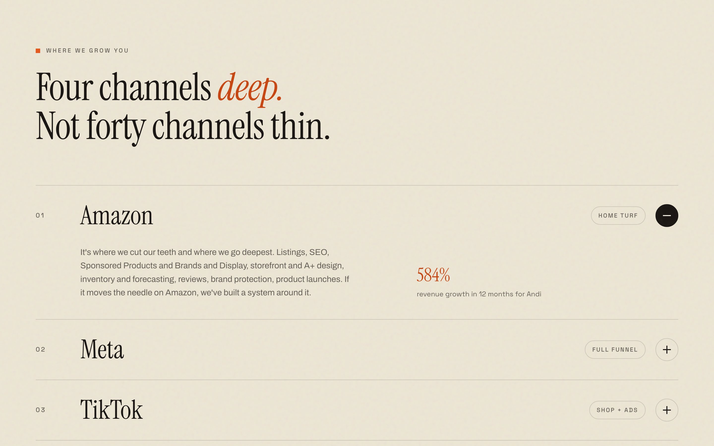
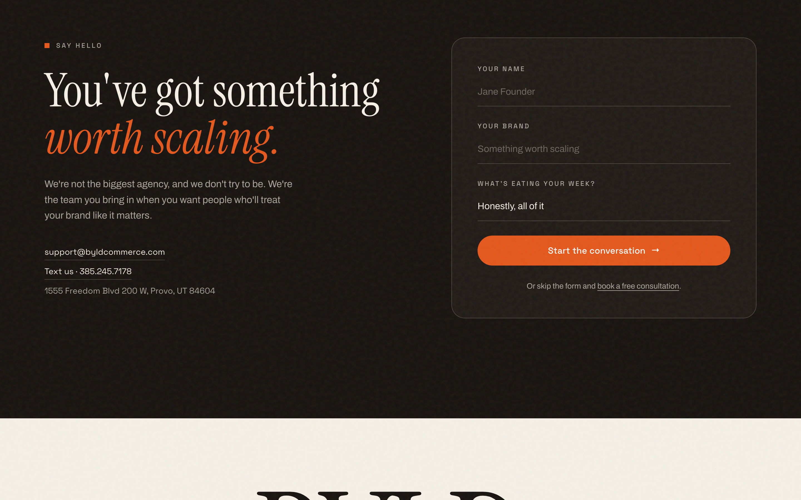

# BYLD Commerce - Website Redesign

A story-driven redesign of [byldcommerce.com](https://www.byldcommerce.com), an ecommerce growth agency in Provo, Utah. Designed and hand-coded from scratch during my web development internship there, then deployed to the company's Squarespace account through a custom code pipeline.



**Live site:** [akallam04.github.io/byld-commerce-website](https://akallam04.github.io/byld-commerce-website/)

**Run it locally:** `python3 -m http.server 4870` from the repo root, then open `localhost:4870`. No build step, no dependencies.

## The assignment

BYLD gave its web interns an intentionally open brief: reimagine the company site so it does two things at once - look genuinely beautiful, and tell a story. Their reasoning: most agency sites list who they are and rattle off every service, and nobody feels anything. Prospective clients don't choose an agency because of a wall of numbers; they choose because they recognize their own situation in what they're seeing.

Every decision in this build had to pass the two tests the brief set:

1. Does it look like something a serious, design-forward brand would be proud of?
2. Would a stranger landing on the page feel understood enough to want to reach out?

Layout, voice, and visuals were left entirely to each intern's own taste, so everything below is my interpretation.

## The concept

Two decisions drive everything else.

**The page tells the client's story, not the agency's.** It opens in second person ("You made something people love. Selling it became the second job.") and spends its whole first half on the founder's problem: a four-chapter scroll story where platform cards literally pile up and bury the founder's product, until BYLD steps in and the chaos snaps into order. The agency only introduces itself at the story's turning point, a line taken from BYLD's own words: "That's the moment most brands find us." Services and channels come after the reader feels understood, results land as evidence rather than as the opener, and the closing form asks "What's eating your week?" - the same language the page opened with.

**Editorial print, not tech-agency neon.** Ecommerce marketing agencies overwhelmingly use the same visual language: dark backgrounds, neon accents, dashboard energy. This build goes the other way - warm paper, ink, one burnt-orange accent, and large serif headlines with italic accent words. The bet: in a tab full of agency sites, the one that looks like a well-set magazine is the one you remember.

## What's on the page

| Section | What happens |
|---|---|
| Hero | Second-person headline plus floating "platform notification" chips (listing suppressed, creative fatigue, algorithm changed) that every founder recognizes |
| Channel marquee | Scrolling ticker of the marketplaces and ad platforms BYLD runs |
| The story | Four-chapter scrollytelling with a sticky animated stage: product box, platform pile-up with alert badges, then the BYLD stamp and a tidy grid |
| The turn | A dark, single-quote pacing beat: "That's the moment most brands find us." |
| What we do | A rotating flywheel (creative feeds ads, ads feed listings, listings turn profit) plus six service cards |
| Channels | An accordion four channels deep - Amazon opens by default as home turf, each channel carries one real client stat |
| Results | A draggable card strip titled "Results you can find in a P&L" |
| How we work | Three principles in the agency's own voice: we're direct, we spend like it's ours, when you win we win |
| Contact | Dark closing section mirroring the hero's language, with a form and direct contact details |
| Footer | Oversized wordmark, tagline, sitemap, and a back-to-top pill |









## Honest numbers only

Every statistic on the page (13x revenue growth, $10K to $20M, 584% in 12 months, 84% creator-driven revenue, and the rest) comes from BYLD's public [case studies](https://www.byldcommerce.com/casestudies). Nothing is invented or rounded up. For an agency whose pitch is "you can see our work in your P&L," the site practicing that same honesty felt non-negotiable.

## Built with

Plain HTML, CSS, and vanilla JavaScript. No frameworks, no build step. That was a deliberate constraint: the final home for this design is Squarespace, which accepts custom code but not toolchains, so every technique had to survive being pasted into a code block.

Under the hood:

- IntersectionObserver drives the scroll reveals and the four-state story stage
- CSS `position: sticky` powers the scrollytelling; state changes are pure class swaps and CSS transitions
- The flywheel is an SVG `textPath` ring rotating on a CSS animation
- The results strip combines scroll-snap with pointer-event dragging
- Reveal masks carry descender padding so serif g and j never get clipped
- `prefers-reduced-motion` disables the preloader and every animation
- A `?capture=<section>` mode pre-reveals content and shifts the page with a paint transform, which is how the screenshots above are generated headlessly

## The Squarespace pipeline

The company runs on Squarespace, so the hand-coded site ships there through a paste kit generated by [`scripts/build-squarespace.py`](scripts/build-squarespace.py):

- **Header code injection** carries the fonts and the entire stylesheet
- **Footer code injection** carries all the JavaScript
- **The Custom CSS panel** hides Squarespace's own header and footer and flattens its section wrappers
- **Ten blank sections**, each holding one code block, carry the page itself

Platform problems the port had to solve, all documented in [PORTING.md](PORTING.md):

- Squarespace injects its own heading and link colors, so every color is asserted with explicit higher-specificity rules
- Squarespace's section wrappers trap `position: fixed` overlays, so the script re-parents the header, menu, and preloader to `body` on load
- The Squarespace editor swallows hash navigation, so anchor scrolling is script-driven
- Squarespace's native header also uses the class `header`, so the build script renames ours to `byld-header` during generation

## Repository map

```
index.html                  the page: structure and copy
css/style.css               design system, layout, animations
js/main.js                  interactions: scrollytelling, accordion, menu, drag
scripts/build-squarespace.py  regenerates the Squarespace paste kit
squarespace/                ready-to-paste deployables (injections + 10 sections)
docs/screenshots/           captured with the site's ?capture mode
PORTING.md                  the full Squarespace porting guide
```

## Context

Built June to August 2026 during my web development internship at BYLD Commerce, alongside Shopify store maintenance and front-end work on client projects. The BYLD brand, copy facts, and case-study results belong to BYLD Commerce and appear here with the team's permission.

Arun Teja Reddy Kallam · [github.com/akallam04](https://github.com/akallam04)
