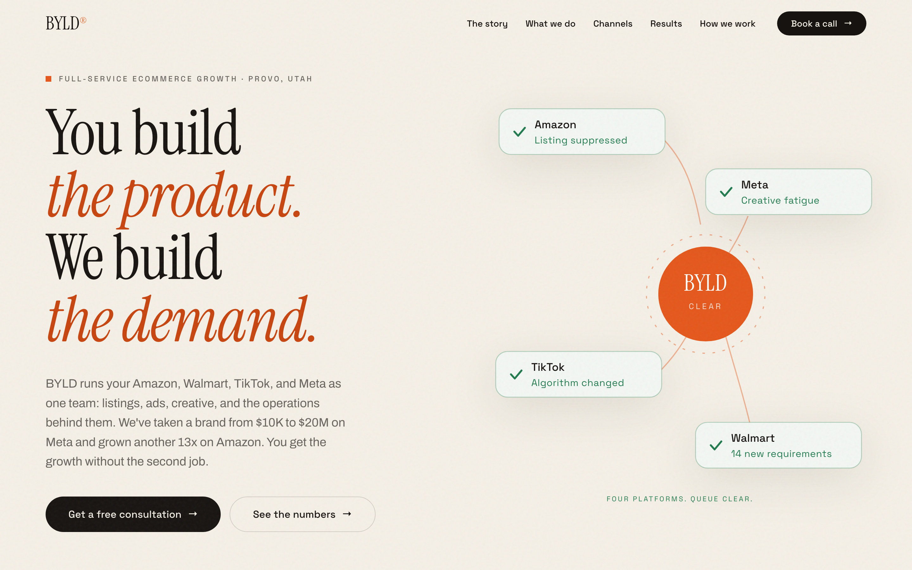
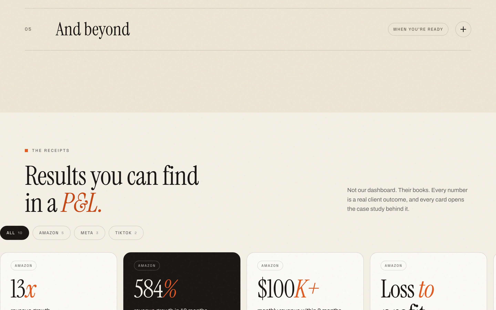

# BYLD Commerce - Website Redesign

A story-driven redesign of [byldcommerce.com](https://www.byldcommerce.com), an ecommerce growth agency in Lehi, Utah. Designed and hand-coded from scratch during my web development internship there, then deployed to the company's Squarespace account through a custom code pipeline.



**Live site:** [akallam04.github.io/byld-commerce-website](https://akallam04.github.io/byld-commerce-website/)

**Run it locally:** `python3 -m http.server 4870` from the repo root, then open `localhost:4870`. No build step, no dependencies.

## The assignment

BYLD gave its web interns an intentionally open brief: reimagine the company site so it does two things at once - look genuinely beautiful, and tell a story. Their reasoning: most agency sites list who they are and rattle off every service, and nobody feels anything. Prospective clients don't choose an agency because of a wall of numbers; they choose because they recognize their own situation in what they're seeing.

Every decision had to pass the two tests the brief set:

1. Does it look like something a serious, design-forward brand would be proud of?
2. Would a stranger landing on the page feel understood enough to want to reach out?

Layout, voice, and visuals were left entirely to each intern's own taste, so everything below is my interpretation.

## The concept

Two decisions drive everything else.

**The page tells the client's story, not the agency's.** It opens on the founder's split reality ("You build the product. We build the demand.") and spends its first half on their problem: a four-chapter scroll story where platform cards pile up and bury the founder's product until BYLD steps in and the chaos snaps into order. The agency only introduces itself at the story's turning point, using BYLD's own line: "That's the moment most brands find us." Capabilities come after the reader feels understood, results land as evidence rather than as the opener, and the closing form asks what's eating their week.

**Editorial print, not tech-agency neon.** Ecommerce marketing agencies overwhelmingly use the same visual language: dark backgrounds, neon accents, dashboard energy. This build goes the other way - warm paper, ink, one burnt-orange accent, and large serif headlines with italic accent words. The bet: in a tab full of agency sites, the one that looks like a well-set magazine is the one you remember.

## What's on the page

| Section | What happens |
|---|---|
| Hero | A live SVG system: platform alerts fire, a packet travels down the wire into the BYLD core, the core absorbs it, the chip flips to handled, then the queue hits CLEAR and resets. Pauses when out of viewport |
| Proof bar | Four real client stats, each linking to its own case study |
| Marquee | Two counter-running rows: channels one way, real client outcomes the other |
| The story | Four-chapter scrollytelling with a sticky stage: the product box buried under platform cards, then the BYLD stamp lands and everything snaps into a grid |
| The turn | A dark single-quote pacing beat between problem and solution |
| What we do | The case against single-lane vendors, then a bento capability wall built around the rotating flywheel, with concrete deliverables per tile and a four-step engagement strip |
| Channels | An accordion four channels deep, Amazon open by default as home turf, each carrying one real client stat |
| Results | Category-filterable cards, drag to scroll, every card linking to its own case study |
| How we work | Three principles in the agency's own direct voice |
| FAQ | Six questions in that same voice, including who BYLD is not a fit for |
| Contact | Qualifying revenue dropdown, mirroring the hero's language |



The scroll story, the flywheel and the hero's alert system only read properly in motion, so they are best seen on the [live site](https://akallam04.github.io/byld-commerce-website/) rather than in a still.

## Built in two passes

The first version was reviewed by my supervisor, who kept three things (the results cards, the flywheel, and the story animation) and pushed on the rest: study how real ecommerce brands write, and rewrite the wordage. The second pass rebuilt the voice around that note, replacing literary lines with concrete ones a founder would actually say, and added the pieces the research showed were missing: proof above the fold, specific deliverables instead of service labels, a direct comparison against the alternative, filterable and linkable evidence, and an FAQ that names who the agency is not for. [COPY-AUDIT.md](COPY-AUDIT.md) documents that research and the section-by-section rationale.

## Honest numbers only

Every statistic on the page comes from BYLD's public [case studies](https://www.byldcommerce.com/casestudies), and each results card links to the specific study it came from. Nothing is invented or rounded up. For an agency whose pitch is "you can see our work in your P&L," the site practicing that same honesty felt non-negotiable.

## Built with

Plain HTML, CSS, and vanilla JavaScript. No frameworks, no build step. That was a deliberate constraint: the final home for this design is Squarespace, which accepts custom code but not toolchains, so every technique had to survive being pasted into a code block.

Under the hood:

- IntersectionObserver drives the scroll reveals, the four-state story stage, and the count-up stats
- The hero runs a single state machine over one 440x460 SVG viewBox, pausing itself when off screen
- CSS `position: sticky` powers the scrollytelling; state changes are pure class swaps and CSS transitions
- The flywheel is an SVG `textPath` ring rotating on a CSS animation
- Results combine category filtering, scroll-snap, and pointer dragging, with drag-versus-click disambiguation so cards stay clickable links
- Accordions are scoped per container so the FAQ and the channels list operate independently
- Reveal masks carry descender padding so serif g and j never get clipped
- `prefers-reduced-motion` disables the preloader and every animation
- A `?capture=<section>` mode pre-reveals content and shifts the page with a paint transform, which is how the screenshots above are generated headlessly

## The Squarespace pipeline

The company runs on Squarespace, so the hand-coded site ships there through a paste kit generated by [`scripts/build-squarespace.py`](scripts/build-squarespace.py):

- **Header code injection** carries the fonts and the entire stylesheet
- **Footer code injection** carries all the JavaScript
- **The Custom CSS panel** hides Squarespace's own header and footer and flattens its section wrappers
- **Eleven blank sections**, each holding one code block, carry the page itself

Platform problems the port had to solve, all documented in [PORTING.md](PORTING.md):

- Squarespace injects its own heading and link colors, so every color is re-asserted with explicit higher-specificity rules
- Squarespace's section wrappers trap `position: fixed` overlays, so the script re-parents the header, menu, and preloader to `body` on load
- The Squarespace editor swallows hash navigation, so anchor scrolling is script-driven
- Squarespace's native header also uses the class `header`, so the build script renames ours to `byld-header` during generation

## Repository map

```
index.html                    the page: structure and copy
css/style.css                 design system, layout, animations
js/main.js                    interactions: hero system, scrollytelling, filters, accordions
scripts/build-squarespace.py  regenerates the Squarespace paste kit
squarespace/                  generated deployables, never edited by hand
preview-single-file.html      the whole site inlined into one shareable file
docs/screenshots/             captured with the site's own capture mode
PORTING.md                    the full Squarespace porting guide
COPY-AUDIT.md                 wordage research and section rationale
```

Edit the local files, run the build script, and re-paste only what it reports as changed. This repo is the source of truth; the Squarespace side is never edited directly.

## Context

Built June to August 2026 during my web development internship at BYLD Commerce, alongside Shopify store maintenance and front-end work on client projects. The BYLD brand, copy facts, and case-study results belong to BYLD Commerce and appear here with the team's permission.

Arun Teja Reddy Kallam · [github.com/akallam04](https://github.com/akallam04)
